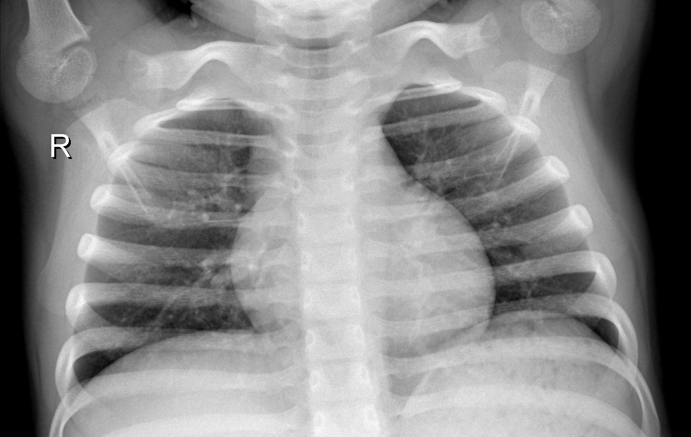
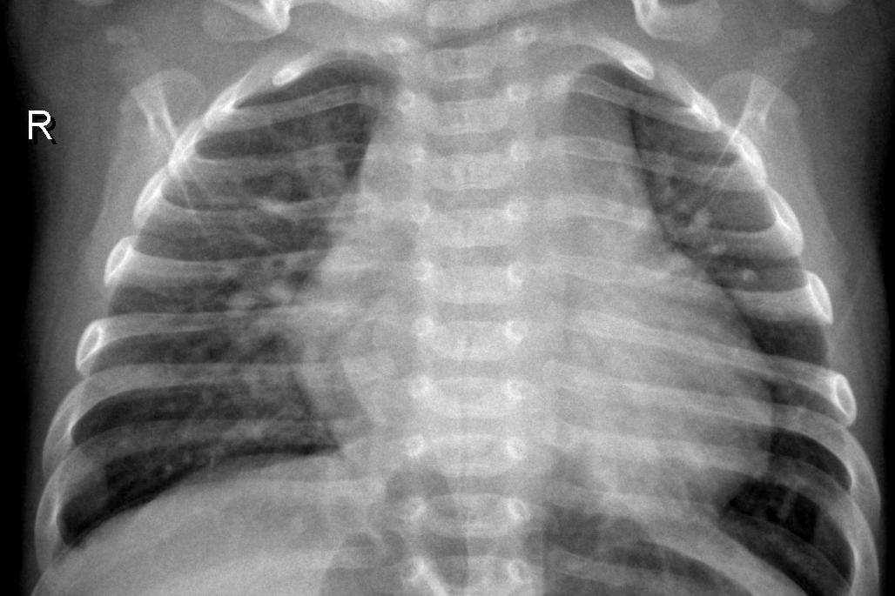

# 🩺 Pneumonia Detection from Chest X-Rays using Deep Learning

This project demonstrates how to use deep learning and transfer learning to detect **pneumonia** in chest X-ray images.  
It uses **MobileNetV2** as a base CNN architecture and is trained on a public medical dataset of over 5,000 chest X-rays.

This is part of my AI for Medical Diagnosis exploration and academic research preparation.

---

## 📂 Dataset

- Source: [Kaggle - Chest X-Ray Images (Pneumonia)](https://www.kaggle.com/datasets/paultimothymooney/chest-xray-pneumonia)
- Images: `train/`, `val/`, and `test/` folders
- Classes: `NORMAL` and `PNEUMONIA`

---

## 🧠 Model

- Transfer learning with **MobileNetV2**
- Layers: Global Average Pooling + Dropout + Dense with sigmoid
- Binary classification: `NORMAL` vs `PNEUMONIA`
- Loss: Binary crossentropy  
- Metrics: Accuracy, precision, recall, F1-score

---

## 🖼️ Sample X-rays

  
  

---

## 📈 Performance

| Metric     | Score           |
|------------|-----------------|
| Accuracy   | 88%             |
| Precision  | 89%             |
| Recall     | 88%             |
| F1-Score   | 87%             |

---

## 💡 Future Work

- Add **Grad-CAM** explainability for model transparency
- Train on larger, multi-class datasets
- Deploy as a diagnostic support tool in low-resource areas

